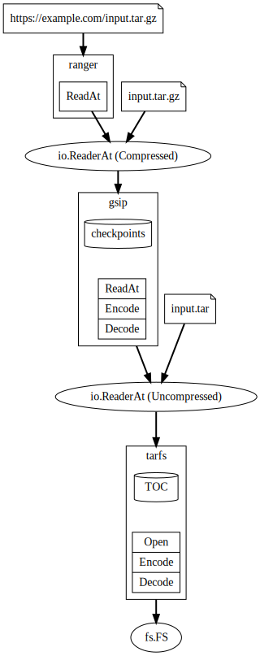

# targz

This module is a collection of packages relating to gzipped tarballs.

Taken together, they allow for fast random access of a filesystem within a gzipped tarball.

This is primarily a proof of concept of the interfaces and how they compose:

## Packages

### gsip

`gsip` is very similar to [`compress/gzip`](https://pkg.go.dev/compress/gzip) but for an `io.ReaderAt` instead of an `io.Reader`.

### tarfs

`tarfs` implements an [`fs.FS`](https://pkg.go.dev/io/fs#FS) given an `io.ReaderAt` for a tar stream.

### ranger

`ranger` implements an `io.ReaderAt` using [HTTP range requests](https://developer.mozilla.org/en-US/docs/Web/HTTP/Range_requests).

## TODO

* Add tests.
* Optimize formats for gsip.Index and tarfs.TOC.
* Allow incremental indexing of both gsip and tarfs metadata.
* Make concurrent tarfs access safe.
* Allow recycling of flate readers.
* Implement better checkpointing heuristics.

## See Also

For more mature implementations of similar ideas, see:

* https://github.com/madler/zlib/blob/develop/examples/zran.c
* https://github.com/circulosmeos/gztool
* https://github.com/awslabs/soci-snapshotter
